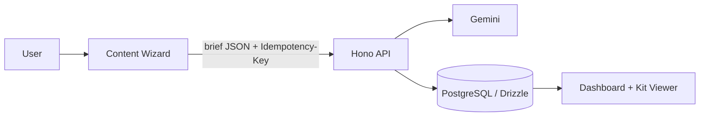

# Social Geni

> AI Content Kits in Minutes. Generate, review, and manage social + image + video kits with a visual dashboard.

---

## Product Preview

### Main screens

| Dashboard (Live) | Wizard (Live) |
|---|---|
|  |  |

| Generated Kits (Live) | Admin Kits Review (Live) |
|---|---|
|  |  |

---

## Stack at a glance

| Layer | Tech |
|---|---|
| Frontend | Vite + React + TypeScript |
| Backend (BFF) | Hono |
| Database | PostgreSQL + Drizzle |
| AI | Gemini (server-side only) |
| Testing | Playwright (smoke E2E) |

---

## Dependency Note (Drizzle)

- The project is currently pinned to the **Drizzle beta stack** for security compliance and tooling compatibility:
  - `drizzle-orm@1.0.0-beta.21`
  - `drizzle-kit@1.0.0-beta.21`
- This was adopted to fully resolve dependency advisories while keeping `drizzle-kit` CLI workflows operational.
- Team guidance: keep these versions aligned, and plan a controlled migration to the first stable `1.x` release when available.

---

## Architecture (simple flow)



---

## Quick Start

```bash
cd ai-content-dashboard
cp .env.example server/.env
cp .env.example client/.env.local

# server/.env
# - GEMINI_API_KEY
# - API_SECRET

# client/.env.local
# - VITE_API_URL

# optional demo mode
# - server/.env: DEMO_MODE=true
# - client/.env.local: VITE_DEMO_MODE=true

npm install
npm run dev
```

- API: `http://localhost:8787`
- UI: `http://localhost:5173`

---

## E2E Smoke Test

```bash
npx playwright install
npm run test:e2e
```

Runs dev servers in demo mode with a temporary DB.

---

## Pre-Push Quality Gates

Run these commands from the repository root before push/deploy:

```bash
npx tsc --noEmit -p client/tsconfig.json
npx tsc --noEmit -p server/tsconfig.json
npm audit --audit-level=high
```

Required production env guard:
- `API_SECRET` must be present and non-empty in production.
- If missing in production, API auth middleware now fails closed with a server misconfiguration response.

---

## Core Features

- Visual wizard with auto-save draft in localStorage (`ai-content-dashboard:wizard-draft:v1`)
- Idempotent synchronous kit generation
- Dashboard list + searchable kit viewer
- Structured social/image/video rendering (with copy actions)
- Retry flow for failed generation (full regenerate)
- Prompt Catalog authoring as creative direction (client context auto-injected server-side)

---

## Prompt Authoring Workflow

- In Prompt Catalog, write **industry creative direction only** (voice, angles, hooks, positioning).
- Backend injects a fixed **Client Context Block** from wizard submission automatically.
- Legacy placeholder templates (`{{brand_name}}` etc.) are still supported for backward compatibility.

---

## Output Contract Highlights

- Social items now return bilingual long-form fields: `post_ar` and `post_en`.
- Each `image_designs[]` item includes bilingual captions: `caption_ar` and `caption_en`.
- Each `video_prompts[]` item includes bilingual captions: `caption_ar` and `caption_en`.
- Visual safety rule is injected into prompt instructions:
  - no Arabic typography/text overlays inside image prompts or video visuals
  - spoken scripts and external captions can still be Arabic
- Backward compatibility remains enabled in UI for historical kits using legacy `post` / `caption`.

---

## API Reference

All `/api/*` routes require:

```http
Authorization: Bearer <API_SECRET>
```

> The bearer token is added by the server-side flow and local test harnesses where needed.
> Frontend runtime no longer reads any `VITE_API_SECRET`.

| Method | Route | Purpose |
|---|---|---|
| `POST` | `/api/kits/generate` | Sync generation (**requires** `Idempotency-Key`) |
| `GET` | `/api/kits` | List kits (newest first) |
| `GET` | `/api/kits/:id` | Kit detail |
| `POST` | `/api/kits/:id/retry` | Retry only `failed_generation` with `{ brief_json, row_version }` |
| `POST` | `/api/kits/:id/regenerate-item` | Regenerate one item only with `{ item_type, index, row_version, feedback? }` |

### Retry semantics

`/api/kits/:id/retry` performs a full end-to-end regeneration from stored `brief_json`.  
It does **not** patch individual failed nodes in `result_json`.

### Partial regenerate semantics

`/api/kits/:id/regenerate-item` regenerates a single target item (`post`, `image`, or `video`) and merges it back into `result_json` using optimistic concurrency via `row_version`.

---

## Known Future Scope

- Field-level repair endpoint (e.g. `POST /api/kits/:id/repair`)
- Structured validation errors with JSON paths
- Shared schema package/OpenAPI types between client and server

---

## Delivery Phases

1. Generate flow + wizard + dashboard + viewer  
2. `row_version` + retry + notifications + badges/toasts  
3. Rate limiting + baseline security headers + demo mode + RTL/a11y + lazy `KitViewer` + Playwright smoke
