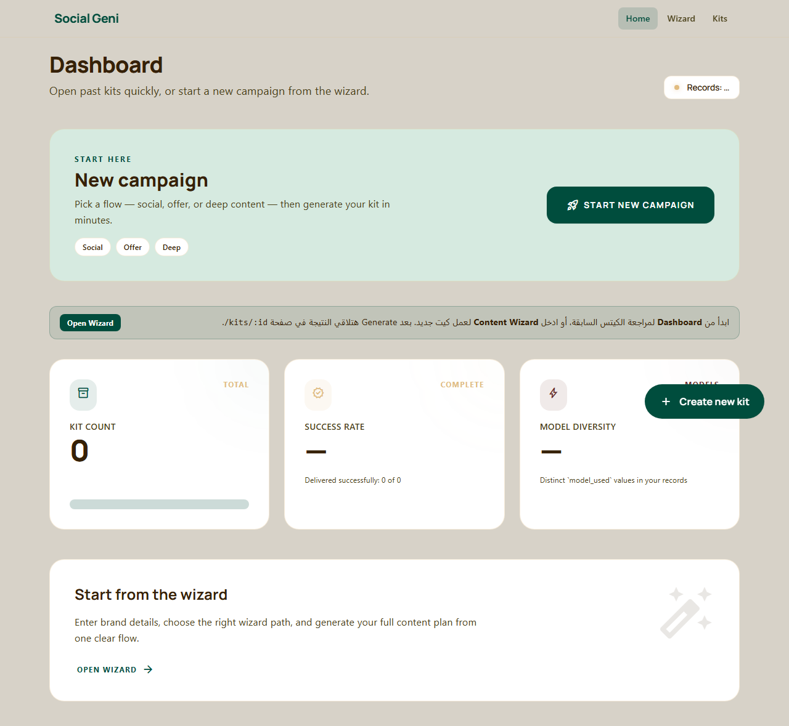
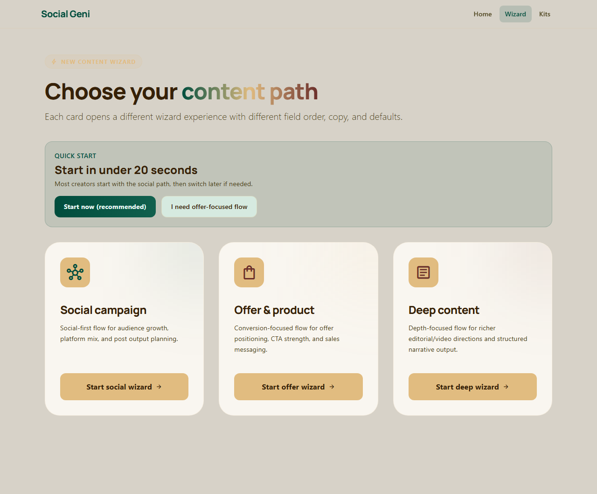
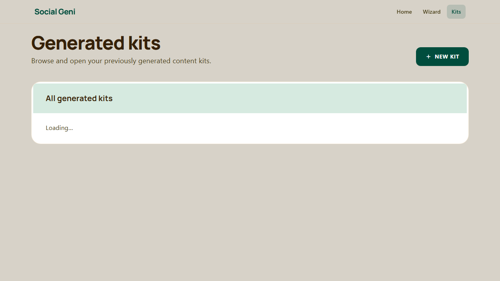
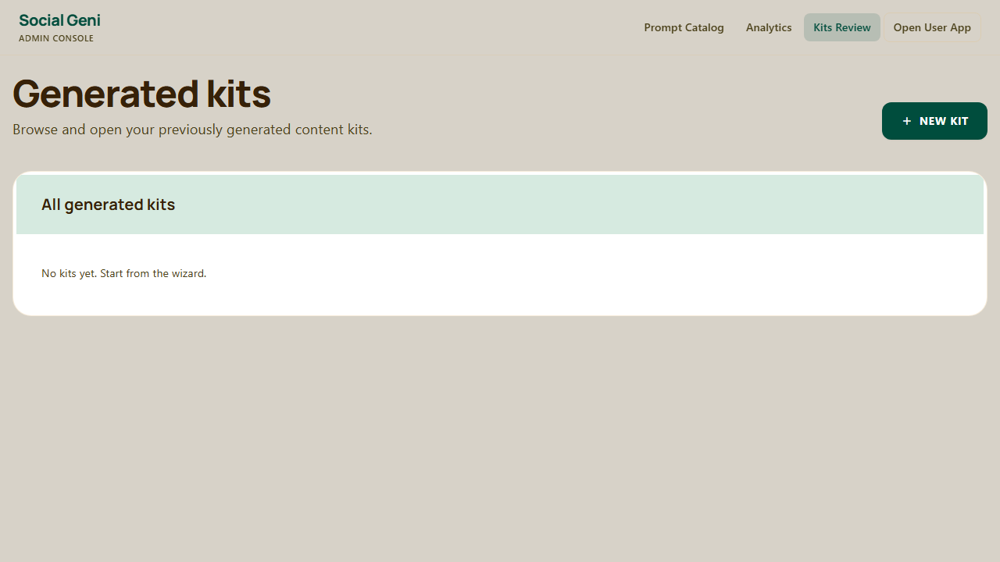
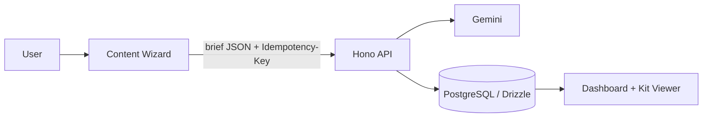

# Social Geni

> AI Content Kits in Minutes. Generate, review, and manage social + image + video kits with a visual dashboard.

---

## Product Preview

### Main screens

| Dashboard (Live) | Wizard (Live) |
|---|---|
|  |  |

| Generated Kits (Live) | Admin Kits Review (Live) |
|---|---|
|  |  |

---

## Stack at a glance

| Layer | Tech |
|---|---|
| Frontend | Vite + React + TypeScript |
| Backend (BFF) | Hono |
| Database | PostgreSQL + Drizzle |
| AI | Gemini (server-side only) |
| Testing | Playwright (smoke E2E) |

---

## Documentation map

**New agent / handoff:** [`AI_HANDOFF.md`](AI_HANDOFF.md). For full doc routing (scope, architecture, DB, prompts, tasking), use **[`docs/CONTEXT_INDEX.md`](docs/CONTEXT_INDEX.md)**. Collaboration rules: [`AGENTS.md`](AGENTS.md).

---

## Dependency Note (Drizzle)

- The project is currently pinned to the **Drizzle beta stack** for security compliance and tooling compatibility:
  - `drizzle-orm@1.0.0-beta.21`
  - `drizzle-kit@1.0.0-beta.21`
- This was adopted to fully resolve dependency advisories while keeping `drizzle-kit` CLI workflows operational.
- Team guidance: keep these versions aligned, and plan a controlled migration to the first stable `1.x` release when available.

---

## Architecture (simple flow)



---

## Quick Start

```bash
cd ai-content-dashboard
cp .env.example server/.env
cp .env.example client/.env.local

# server/.env
# - GEMINI_API_KEY
# - API_SECRET

# client/.env.local
# - VITE_API_URL

# optional demo mode
# - server/.env: DEMO_MODE=true
# - client/.env.local: VITE_DEMO_MODE=true

npm install
npm run dev
```

- API: `http://localhost:8787`
- UI: `http://localhost:5173`

---

## E2E Smoke Test

```bash
npx playwright install
npm run test:e2e
```

Runs dev servers in demo mode with a temporary DB.

---

## Pre-Push Quality Gates

Run these commands from the repository root before push/deploy:

```bash
npx tsc --noEmit -p client/tsconfig.json
npx tsc --noEmit -p server/tsconfig.json
npm audit --audit-level=high
```

Required production env guard:
- `API_SECRET` must be present and non-empty in production.
- If missing in production, API auth middleware now fails closed with a server misconfiguration response.

---

## Core Features

- Visual wizard with auto-save draft in localStorage (`ai-content-dashboard:wizard-draft:v1`)
- Idempotent synchronous kit generation
- Dashboard list + searchable kit viewer
- Structured social/image/video rendering (with copy actions)
- Retry flow for failed generation (full regenerate)
- Prompt Catalog authoring as creative direction (client context auto-injected server-side)

---

## Prompt Authoring Workflow

- In Prompt Catalog, write **industry creative direction only** (voice, angles, hooks, positioning).
- Backend injects a fixed **Client Context Block** from wizard submission automatically.
- Legacy placeholder templates (`{{brand_name}}` etc.) are still supported for backward compatibility.

---

## Kit JSON schema (`result_json`)

The model output stored on each kit row follows the **Gemini response schema** defined in code:

- **Source of truth:** `server/src/logic/responseSchema.ts` (`getGeminiResponseSchema()`)

### Top-level shape (required keys)

| Key | Type | Notes |
|-----|------|--------|
| `posts` | `object[]` | Social posts: `platform`, `format`, `goal`, **`post_ar`**, **`post_en`**, `hashtags[]`, `cta` |
| `image_designs` | `object[]` | Image briefs: `platform_format`, `design_type`, `goal`, `visual_scene`, `headline_text_overlay`, `supporting_copy`, `full_ai_image_prompt`, **`caption_ar`**, **`caption_en`**, `text_policy`, `conversion_trigger` |
| `video_prompts` | `object[]` | Video briefs: `platform`, `duration`, `style`, `hook_type`, `scenes[]` (`time`, `label`, `visual`, `text`, `audio`), **`caption_ar`**, **`caption_en`**, `ai_tool_instructions`, `why_this_converts` |
| `marketing_strategy` | `object` | `content_mix_plan`, `weekly_posting_plan`, `platform_strategy`, `key_messaging_angles[]`, `brand_positioning_statement` |
| `sales_system` | `object` | `pain_points[]`, `offer_structuring`, `funnel_plan`, `ad_angles[]`, `objection_handling[]` (`objection`, `response`), `cta_strategy` |
| `offer_optimization` | `object` | `rewritten_offer`, `urgency_or_scarcity`, `alternative_offers[]` |
| `diagnosis_plan` | `object` | `quickWin24h`, `focus7d`, `priority`, `rationale` |
| `narrative_summary` | `string` | Single narrative block |

### Optional top-level keys

| Key | Type | Notes |
|-----|------|--------|
| `kpi_tracking` | `object?` | `top_kpis[]`, `benchmarks`, `optimization_actions`, `ab_tests_week1[]` (allowed by schema; may be empty or omitted depending on model) |
| `content_ideas_package` | `object?` | **Not** in the base Gemini schema; merged when the **content package** chain is enabled. Shape consumed by the UI: `ideas[]` (`id`, `title`, `description`), `hooks[]` (`idea_id`, `variant_index`, `hook_text`), `templates[]` (`idea_id`, `template_format`). See `client/src/features/kits/kitViewModel.ts`. |

### Prompt / safety notes (bilingual + visuals)

- Posts and captions are **bilingual** (`*_ar` / `*_en`). Legacy single-field `post` / `caption` may exist on older kits; the viewer normalizes where needed.
- Prompt instructions enforce **no Arabic text burned into** image/video **visuals**; Arabic is fine for scripts and external captions.

### Viewer compatibility (legacy key aliases)

`buildKitViewModel` may resolve older or alternate keys for images/videos (e.g. `image_prompts`, `video_assets`). New generations use `image_designs` and `video_prompts` as above.

---

## Content Wizard — routes and steps

Three campaign modes, each with its own route and draft key (auto-saved in `localStorage`).

| Mode | Route | Draft key suffix | Default `campaign_mode` |
|------|--------|------------------|-------------------------|
| Social-first | `/wizard/social` | `wizard-draft:social:v1` | `social` |
| Offer / product | `/wizard/offer` | `wizard-draft:offer:v1` | `offer` |
| Deep content | `/wizard/deep` | `wizard-draft:deep:v1` | `deep` |

**Experiment (Variant B — “Quick diagnosis” first):** About **20%** of sessions get **Variant B** unless overridden. Force with query param **`?wizard_exp=B`** (or `A`). Stored under `ai-content-dashboard:wizard-exp:v1`.

### Step order by mode

Step **ids** match `stepOrder` in each wizard file; labels are the **chip titles** shown in the UI.

**Social Campaign** (`SocialCampaignWizard.tsx`)

| Variant | Step order (ids → chip title) |
|---------|-------------------------------|
| **A** | `brand` → Brand & industry → `audience` → Audience & goals → `channels` → Channels & tone → `creative` → Creative direction → `volume` → Output volumes |
| **B** | `diagnosis` → Quick diagnosis → then same as A from `brand` … `volume` |

**Offer / Product** (`OfferProductWizard.tsx`)

| Variant | Step order |
|---------|------------|
| **A** | `brand` → Brand & industry → `offer` → Offer & positioning → `audience` → Audience & goals → `volume` → Output volumes |
| **B** | `diagnosis` → Quick diagnosis → `brand` → … → `volume` |

**Deep Content** (`DeepContentWizard.tsx`)

| Variant | Step order |
|---------|------------|
| **A** | `brand` → Brand & industry → `audience` → Audience & goals → `creative` → Creative direction → `volume` → Output volumes |
| **B** | `diagnosis` → Quick diagnosis → `brand` → … → `volume` |

Shared implementation: `client/src/pages/wizards/WizardCore.tsx`. After the last step, submission calls **`POST /api/kits/generate`** with the brief JSON and **`Idempotency-Key`**.

---

## API Reference

All `/api/*` routes require:

```http
Authorization: Bearer <API_SECRET>
```

> The bearer token is added by the server-side flow and local test harnesses where needed.
> Frontend runtime no longer reads any `VITE_API_SECRET`.

| Method | Route | Purpose |
|---|---|---|
| `POST` | `/api/kits/generate` | Sync generation (**requires** `Idempotency-Key`) |
| `POST` | `/api/kits/generate?stream=1` | SSE generation stream (`status` / `reasoning` / `partial` / `complete`) |
| `GET` | `/api/kits` | List kits (newest first) |
| `GET` | `/api/kits/:id` | Kit detail |
| `POST` | `/api/kits/:id/retry` | Retry only `failed_generation` with `{ brief_json, row_version }` |
| `POST` | `/api/kits/:id/regenerate-item` | Regenerate one item only with `{ item_type, index, row_version, feedback? }` |

### Retry semantics

`/api/kits/:id/retry` performs a full end-to-end regeneration from stored `brief_json`.  
It does **not** patch individual failed nodes in `result_json`.

### Partial regenerate semantics

`/api/kits/:id/regenerate-item` regenerates a single target item (`post`, `image`, or `video`) and merges it back into `result_json` using optimistic concurrency via `row_version`.

### Stream generate semantics (Phase 1)

`/api/kits/generate?stream=1` is additive and does not replace the normal contract.

- Stream emits SSE events in order:
  - `status` (stage updates)
  - `reasoning` (stream-only, bounded rationale trace for UX)
  - `partial` (progressive `result_json` snapshots, light fields first)
  - `complete` (final `KitSummary`)
  - `error` (safe message)
- Idempotency behavior remains the same as standard generate.
- `reasoning` is best-effort and never persisted in `result_json`.

---

## Known Future Scope

- Field-level repair endpoint (e.g. `POST /api/kits/:id/repair`)
- Structured validation errors with JSON paths
- Shared schema package/OpenAPI types between client and server

---

## Delivery Phases

1. Generate flow + wizard + dashboard + viewer  
2. `row_version` + retry + notifications + badges/toasts  
3. Rate limiting + baseline security headers + demo mode + RTL/a11y + lazy `KitViewer` + Playwright smoke
