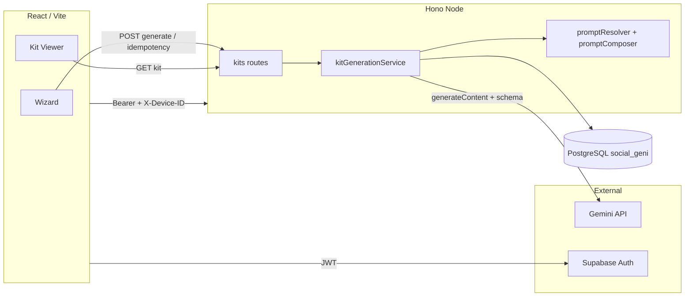

# Project Brief: Social Geni (AI Content Dashboard)

This document explains **what the product is for**, **why it exists**, and **how users are meant to experience it**. Package name in the repo is `social-geni`; the product narrative is **AI Content Kits**—turning a brand brief into a **single, reviewable bundle** of copy, creative direction, and strategy you can actually ship.

For API details, env vars, and commands, see [`README.md`](README.md).

**Document map (for humans + LLM context routing):** paste or attach **this whole file** when a tool needs wizard + kit + DB + prompt detail. If context is limited, use **[`docs/CONTEXT_INDEX.md`](docs/CONTEXT_INDEX.md)** to route to the right file. High-signal anchors:

| § / doc | Topic |
|---------|--------|
| **5.2** | Wizard — step counts, `brief_json` inputs, behavioral UX |
| **10.3** | Drizzle / PostgreSQL — **full column inventory** |
| **10.4** | Kit `result_json` — sections, fields, legacy keys |
| **10.5** | Prompt pipeline — **`composePrompt` order**, Gemini request, rule excerpts |
| [`docs/DATABASE.md`](docs/DATABASE.md) | Same tables/columns as §10.3 in **compact** form for agents |
| [`docs/GEMINI_PROMPTS.md`](docs/GEMINI_PROMPTS.md) | Prompt excerpts + file map (Category-2 surgical reference) |

---

## 1. The idea in one sentence

**Social Geni helps a brand or marketer go from a structured interview (the wizard) to a complete “marketing kit”—posts, image prompts, video plans, and supporting strategy—in one synchronous generation, then review, copy, and refine individual pieces without starting over.**

The site is not “another chat with AI.” It is a **pipeline**: capture context once, enforce a **fixed output shape**, store the result as a **first-class artifact** (a kit), and present it in a UI built for **execution** (copy buttons, sections, retries), not open-ended conversation.

---

## 2. The problem it tries to solve

Small teams, freelancers, and regional brands often hit the same wall:

- They know their offer and audience but **lack time** to produce a coherent month of content.
- Generic AI chat gives **fragments**—a caption here, a vague image idea there—with no **single document** that matches their brief, tone, and constraints.
- **Bilingual** markets (e.g. Arabic and English for social captions and metadata) multiply the work: two languages, one brand voice, easy to drift.
- **Creative tools** (image/video generators) need **technical prompts**; marketing people do not always know how to write scene-level instructions that survive real tools.

Social Geni compresses that work: one submission, one stored **kit** that bundles **executable assets** (copy + prompts) with **reasoning layers** (strategy, offer framing, objections) so the output is useful for both **content** and **sales** conversations.

---

## 3. What a “kit” means in this product

A **kit** is the persisted result of one generation run. Conceptually it contains:

- **Social layer**: Platform-aware posts with goals, bilingual long-form body copy where the schema requires it, hashtags, and CTAs—ready to adapt and paste.
- **Visual layer**: Image-oriented blocks with scene descriptions, overlay guidance, full AI image prompts, captions, and conversion-oriented notes—so design or AI tooling has a **spec**, not a whim.
- **Video layer**: Short-form oriented plans—structure, scenes, tool-oriented instructions, and “why this converts” style rationale.
- **Strategy layer**: Not fluff—**marketing strategy** (mix, cadence, platforms, angles, positioning), **sales system** (pains, funnel thinking, ad angles, objection handling), **offer optimization** (sharpened offer line, urgency framing, alternatives), plus **diagnosis** and a **narrative summary** so the user sees *why* the assets fit together.

The UI (**Kit Viewer**) is organized around these layers so a user can **jump to the section they need** (e.g. only video prompts for an editor, only posts for a community manager) instead of scrolling an unstructured wall of text.

For the **exact JSON keys and every generated field**, see **§10.4** (canonical schema in `server/src/logic/responseSchema.ts`).

---

## 4. Who it is for (and how they use it)

| Persona | What they get from the product |
|--------|--------------------------------|
| **Brand owner / marketing lead (V2 client)** | A guided agency intake, clear order-received state, and quick re-ordering through saved brand presets without exposing internal operational kit tooling. |
| **Social manager** | **Copy-paste-ready posts** and hashtag/CTA structure; language toggle where the kit exposes Arabic and English fields. |
| **Designer or AI operator** | **Image and video prompt blocks** detailed enough to feed Midjourney, DALL·E, Runway-class tools, etc. |
| **Sales or growth** | **Pain points, objections, funnel and CTA angles** from the sales-system portion of the kit—useful for landing pages, ads, or call scripts. |
| **Internal admin / strategist** | **Prompt catalog** and industry templates so the *voice of the machine* stays on-brand across many kits; **analytics** on wizard usage; ability to **see all kits** for QA/support, including **admin-side hard delete** for junk/duplicate requests; **user/admin role management** and operational plan controls. |

The public V2 flow is **agency-intake first** (client submits request, internal team fulfills). Authenticated users still get persistent account-level features (profile, brand voice, saved preferences, brand history), while admins use separate routes to see **everything** and manage privileged access.

---

## 5. The user journey (purpose of each major surface)

### 5.1 Dashboard and client portal

Purpose: **Orientation and continuity** for V2 clients. The portal now centers on:

- **Overview** (how agency delivery works),
- **My Brands** (brand cards extracted from historical briefs),
- **Request Content** (wizard entry),
- **Pricing** (one-time packages and WhatsApp sales CTA).

In agency mode, generated kits are handled as an **internal admin surface**, not a public client viewer.

### 5.2 The wizard (three campaign modes)

Purpose: **Turn implicit knowledge into explicit constraints** the model cannot guess—brand, industry, audience, goals, platforms, tone, offer, budget band, counts of posts/images/videos, and mode of campaign (`social`, `offer`, `deep`).  

**Draft saving** exists so the journey respects real life: users abandon tabs and return. The product goal is to **reduce abandonment** and **increase completion quality** (fuller briefs → better kits).

Implementation reference: `client/src/pages/wizards/WizardCore.tsx`, per-mode wrappers (`SocialCampaignWizard.tsx`, `OfferProductWizard.tsx`, `DeepContentWizard.tsx`), validation in `client/src/briefSchema.ts`.

#### 5.2.1 How many steps? (by mode and A/B variant)

The UI shows **one screen per step** with **“Step *i* of *n*”**, a **progress bar**, and **step chips** for the whole path. **Variant B** prepends a **Quick diagnosis** step (~20% of sessions, or force with `?wizard_exp=B`; stored in `localStorage`).

| Campaign mode | Route | Variant A — *n* steps | Variant B — *n* steps | Step IDs in order |
|----------------|-------|----------------------|----------------------|-------------------|
| **Social** | `/wizard/social` | **5** | **6** | A: `brand` → `audience` → `channels` → `creative` → `volume` |
| | | | | B: `diagnosis` → then same as A |
| **Offer / product** | `/wizard/offer` | **4** | **5** | A: `brand` → `offer` → `audience` → `volume` |
| | | | | B: `diagnosis` → then same as A |
| **Deep content** | `/wizard/deep` | **4** | **5** | A: `brand` → `audience` → `creative` → `volume` |
| | | | | B: `diagnosis` → then same as A |

The **last step is always `volume`**: output counts, optional content-package toggle, optional email, and (when logged in) a **plan usage** summary.
In `starter`, this step is treated as a limited free-sample submit gate; in `early_adopter`, advanced controls are fully available.

#### 5.2.2 Inputs collected (payload shape: `brief_json`)

All modes share one **form model** (`BriefForm` / `briefSchema` in `briefSchema.ts`). Only **some steps appear** per mode; fields on skipped steps may stay at defaults. **Required** fields depend on the active **zod** schema (`socialBriefSchema`, `offerBriefSchema`, `deepBriefSchema`, plus `*WithDiagnosis` when Variant B).

| Step (when shown) | Fields the user edits | Control pattern | Mode notes |
|--------------------|----------------------|-----------------|------------|
| **diagnosis** | `diagnostic_role`, `diagnostic_account_stage`, `diagnostic_followers_band`, `diagnostic_primary_blocker`, `diagnostic_revenue_goal` | Native **selects** (structured slugs) | Variant **B** only; all five required in `*WithDiagnosis` schemas |
| **brand** | `brand_name`, `industry` | Text + **industry** dropdown (preset list or “Other” free text) | All modes; `brand_name` always required |
| **audience** | `target_audience`, `main_goal` | **PillGroup** multi-select + optional “Other”; **SelectableCard** grid for goal + optional “Other” | Social, Offer, Deep; Offer/Deep skip `channels` |
| **channels** | `platforms`, `brand_tone`, `brand_colors` | Pills + cards + optional “Other”; free-text colors | **Social only** (not in Offer/Deep `stepOrder`) |
| **offer** | `offer`, `competitors` | **Textareas** | **Offer** mode only (dedicated step; **no** `creative` step in Offer flow) |
| **creative** | See below | `AdditionalNotes`, image uploader, pills, optional text | **Not used in Offer** (`stepOrder` has no `creative`). **Social:** `visual_notes`, `reference_image`, `best_content_types` only. **Deep:** same three + **`campaign_duration`** (required in schema). `budget_level` exists in the shared form but is **not** shown in these two paths’ `stepFields`. **Reference image** disabled on **Starter** plan (upgrade CTA) |
| **volume** | `num_posts`, `num_image_designs`, `num_video_prompts`, `include_content_package`, `content_package_idea_count`, `email` | Numeric inputs (clamped: posts **0–25**, images **0–10**, videos **0–10**, package ideas **0–25**), checkbox + explainer, optional email | **All modes**; moving **Next** on prior steps only validates **that step’s** field list (`useWizardOrchestrator` + `trigger`). **Final** submit runs **full** path schema |

**Always set server-side from defaults:** `campaign_mode` is `social` | `offer` | `deep` per wizard entry route.

**Agency intake requirement:** `client_name`, `client_phone`, and `client_email` are required in both free and paid agency submissions. Payment/access changes unlocked capabilities, not these intake requirements.

**Validation behavior:** `react-hook-form` with **`mode: "onTouched"`**; **Next** triggers validation for **only** the keys mapped to the current step (`stepFieldMap`). Red inline errors appear under invalid fields.

#### 5.2.3 Behavioral UX (what the user *feels* while filling) — Category 1

These are the **observable experience levers** while using the wizard (not the kit output):

| Moment | User perception | Product intent |
|--------|-----------------|----------------|
| **Orientation** | Clear **step index**, **segment title**, and **chip trail** of the whole journey | Reduces “where am I?” anxiety on long forms |
| **Progress** | **Bar fills** as steps advance | Sense of nearness to completion |
| **Return visits** | Banner: **draft restored** for this path, with option to **clear** | Safety net; lowers cost of interruption |
| **Momentum (mid-flow)** | After brand + industry are set, optional **value preview** (“direction” line from goal/audience) | Early emotional payoff; confirms the machine “gets” them |
| **Choices** | **Cards and pills** (goals, tone, platforms, audiences) vs. raw empty text | Faster, more **scannable** than a single giant form; **Arabic-forward** labels on selectable options |
| **Friction honesty** | **Starter**: reference image **locked** with **Upgrade** link | Sets expectation; avoids silent failure |
| **Trust before submit (Variant B)** | On last step: **recap tiles** (role, blocker, revenue) + short **“proof”** bullets (repeatable execution, regenerate later, draft-safe) | Mirrors sales page promises; aligns CTA copy (“Show my diagnosis and plan”) with **diagnosis** framing |
| **Trust before submit (Variant A)** | Copy: **~10–30 s**, draft stays saved, edit after generation | Sets wait expectation; reduces panic clicks |
| **Waiting** | Full-card **loading overlay**, **rotating** status lines (“Analyzing…”, “Crafting hooks…”, “Preparing visual prompts…”) | Occupies wait meaningfully; `aria-live` for assistive tech |
| **Commit** | Primary button: **Generate** / **Show my diagnosis…** vs **Next** on earlier steps | Clear **commit** vs **explore** distinction |
| **Plan awareness** | Logged-in users see **current plan** and **video/image usage** counts on the last step | Transparency before a billable generation |

Together, the wizard should feel like a **guided interview** (structured, saved, validated per screen) rather than a **single intimidating form** or a chat thread.

### 5.3 Generation moment

Purpose: **One authoritative run** per logical request. In V2 agency mode, users submit once and are redirected to an order-received confirmation while fulfillment continues through internal/admin operations.

**Idempotency and charge-once controls** ensure:

- duplicate clicks/retries do not create duplicate charges,
- usage deduction runs only once after successful persistence,
- pending duplicate briefs are blocked until the in-flight request resolves.

### 5.4 Kit detail (viewer)

Purpose: **Make the kit actionable** for internal/admin workflows. Collapsible sections, copy actions, optional technical JSON, **admin exports (PDF + Excel)**, and **partial regeneration** (one post, one image block, one video item) support the real workflow: *“Everything else is fine—redo item 3 with this feedback.”*

### 5.5 Admin: Prompt catalog

Purpose: **Separate “how we want the AI to think” from “what this client typed.”** Authors maintain **industry creative direction** (hooks, angles, tone rules). The server still injects **client context from the wizard** so each kit stays anchored to that submission. That separation is core to scaling quality across many brands without editing code for every tweak.

### 5.6 Admin: Analytics and full kit review

Purpose: **Improve prompts and spot failures**. Seeing all kits and how people move through the wizard informs product and content strategy—not just debugging.

### 5.7 Account surfaces (Profile, Brand Voice, Integrations, Help)

Purpose: make account features **real and persistent**, not placeholder UI.

- **Profile** stores user-facing identity settings synced with auth.
- **Brand Voice** stores writing pillars, avoided words, and a sample snippet; this context is injected into generation prompts.
- **Integrations** surface product readiness and connection roadmap in a clear UX.
- **Help** gives searchable guidance and quick support paths.

---

## 6. Current monetization model (Agency packages)

The V2 public model is **productized service packaging**, not a recurring SaaS checkout:

- **Free Sample package** (lead magnet): 1 video prompt, 2 image prompts, 1 social post, 1 hook.
- **Premium Agency package** (paid): service deliverables (custom videos, image designs/prompts, ready-to-publish posts, hooks/media strategy).
- **Payment path:** CTA redirects to WhatsApp (`wa.me`) with prefilled Arabic payment message for manual completion.

The pricing philosophy is intentional: reduce purchase friction, route demand into a managed agency workflow, and optimize package conversion through operational feedback.

### 6.1 Capability matrix (free vs paid operations)

| Capability | Starter (free sample) | Early Adopter (paid) |
|---|---|---|
| Allowed campaign modes | `social` only | `social`, `offer`, `deep` |
| Advanced wizard controls (`volume` step) | limited/free-submit gate | fully enabled |
| Reference image upload | locked | enabled |
| Monthly video prompts | 1 | 2 |
| Monthly image prompts | 2 | 10 |
| Retry/regenerate actions | blocked by plan limits | available (plan allows unlimited) |
| Agency order intent after submit | `free` | `paid` |

---

## 7. Why structured JSON (and strict validation) matters to the *idea*

If the model returned free-form prose, the app could not reliably show **“Video prompt #2”** or **merge a regenerated post back into the kit**. The product promise of a **kit** depends on a **contract**: known keys for posts, designs, videos, strategy objects, etc.

That is why the backend uses a **response schema** and validation: the **UX is designed around predictable blocks**. The user should feel they received a **designed deliverable**, not a lucky paste from a chat window.

Creative-policy rules (e.g. constraints around **Arabic text inside image/video visual frames** vs. captions and scripts) exist so outputs stay **usable** in real creative pipelines and regional contexts.

Prompting policy also enforces production-oriented output quality, including:

- stronger negative constraints for generated visual prompts,
- camera-language guidance for video prompts,
- motion-control wording to reduce artifacts,
- anti-repetition and diversity controls to reduce near-identical outputs across runs.

---

## 8. Reliability and iteration as product features

- **Failed generation**: The user should be able to **retry** with a clear path (full retry from stored brief), not lose the brief or start from zero manually.
- **Row versioning**: Prevents two tabs from silently overwriting each other’s updates—again, about **trust** in the artifact.
- **Regenerate one item**: Matches how people work—“fix this asset only.”
- **Plan and usage enforcement**: Usage checks are tied to active plan subscriptions and per-period counters so product limits stay predictable.

These are not secondary; they reinforce that a **kit is an object you own and refine**, not a disposable chat transcript.

---

## 9. Positioning summary

| Dimension | Intent |
|-----------|--------|
| **Vs. generic ChatGPT** | Fixed structure, stored kits, wizard-driven context, bilingual fields where defined, copy-oriented UI, and account-aware brand voice injection. |
| **Vs. a static template shop** | Every kit is **generated** from the user’s brief and industry prompts, not a dead PDF. |
| **Vs. a pure scheduling tool** | Strong on **creation** (copy + prompts + strategy); scheduling is out of scope unless added later. |

---

## 10. Technical map (architecture, data, prompts, APIs)

This section is the **internal blueprint** of the platform: how data moves, what is stored, and where to change behavior. It is written so tooling (e.g. Gemini Deep Research) can reason about **realistic** next steps without inventing incompatible stacks.

### 10.1 Architecture overview (end-to-end flow)

High-level path:

1. **Wizard** (`client`) — User fills campaign brief (brand, goals, platforms, counts, mode, etc.). Draft may be saved locally; submission builds a **brief payload** sent to the API.
2. **Hono API** (`server`) — Validates input, resolves **plan / usage / idempotency**, builds a **submission snapshot**, composes prompts, calls **Gemini** with a **JSON response schema** (`responseMimeType: application/json` + schema).
3. **Gemini** — Returns structured JSON (and usage metadata; server may fall back to `countTokens` when metadata is missing). Optional **content package** chain may run additional JSON steps (ideas / hooks / templates) merged into the kit payload.
4. **PostgreSQL** — Persisted via **Drizzle ORM** in schema `social_geni`: `brief_json`, array fields (`jsonb`), `result_json` (generated kit), delivery status, model metadata, optional **per-kit token counts** (admin-only in API responses).
5. **Kit Viewer** — Client loads kit summary + `result_json`, parses with **`buildKitViewModel`** into sections (posts, images, video, strategy, optional `content_ideas_package`).



**Startup:** The API runs **SQL migrations** from `server/src/db/migrations.ts` on boot (`runMigrations()` in `server/src/index.ts`), then serves routes.

### 10.2 Tech stack (versions and workspaces)

Monorepo **`social-geni`** (npm workspaces: `client`, `server`).

| Layer | Choices | Notes |
|--------|---------|--------|
| **Client** | **React 19**, **Vite 6**, **TypeScript ~5.7** | SPA; routing: **react-router-dom 7** |
| **Forms / validation** | **react-hook-form**, **zod**, **@hookform/resolvers** | Wizard and API bodies aligned with zod where applicable |
| **Auth** | **@supabase/supabase-js** | Google (and session); access token sent to BFF |
| **Styling** | **Tailwind CSS 3**, PostCSS, **@tailwindcss/forms** | No shadcn/ui in repo; custom components |
| **Server** | **Hono 4**, **@hono/node-server** | Single process; CORS + optional Supabase JWT |
| **DB** | **PostgreSQL**, **drizzle-orm** + **drizzle-kit** (beta 21 track), **`pg`** | Schema isolated in **`social_geni`** |
| **AI** | **Google Gemini** via REST (`server/src/logic/geminiClient.ts`) | `responseSchema` for structured output; env-driven model/temperature |
| **Tests** | **Vitest** (server), **Playwright** (client e2e optional) | `npm run test` runs server tests |

**Representative `package.json` excerpt (root scripts):**

```json
{
  "name": "social-geni",
  "workspaces": ["server", "client"],
  "scripts": {
    "dev": "concurrently … server + client",
    "build": "npm run build -w server && npm run build -w client",
    "test": "npm run test -w server"
  }
}
```

### 10.3 Database schema (Drizzle / PostgreSQL)

- **Schema name:** `social_geni` (avoids collisions with other apps on shared hosting).
- **Indexes / constraints in repo:** Drizzle defines **primary keys**, **`unique()`** where noted below, and **notNull / defaults**. There are **no extra `index()` declarations** in `schema.ts`—telemetry or reporting queries that filter on `user_id`, `device_id`, `created_at`, etc. currently rely on table scans unless migrations add indexes separately. Proposals for new tables should **avoid duplicating** these entities.

**Source of truth in repo:** `server/src/db/schema.ts`. Boot-time DDL / migrations: `server/src/db/migrations.ts` (includes additive `ALTER TABLE … ADD COLUMN IF NOT EXISTS` for safe deploys).

#### 10.3.1 Column inventory (all tables)

Types reflect Drizzle definitions (`timestamp` = `timestamptz`, `bigint` = JS number mode).

**`social_geni.kits`**

| Column | Type | Constraints / notes |
|--------|------|---------------------|
| `id` | text | **PK** |
| `device_id` | text | `notNull`, default `''` |
| `user_id` | text | nullable |
| `brief_json` | text | `notNull` — stringified wizard payload |
| `brief_hash` | text | `notNull`, default `''` — normalized brief fingerprint for idempotency |
| `target_audience_v2` | jsonb (`string[]`) | `notNull`, default `[]` |
| `platforms_v2` | jsonb (`string[]`) | `notNull`, default `[]` |
| `best_content_types_v2` | jsonb (`string[]`) | `notNull`, default `[]` |
| `ui_preferences` | jsonb | `notNull`, default `{}` — persisted viewer state |
| `result_json` | text | nullable — stringified kit JSON |
| `delivery_status` | text | `notNull` |
| `model_used` | text | `notNull` |
| `last_error` | text | `notNull`, default `''` |
| `correlation_id` | text | `notNull` |
| `prompt_version_id` | text | nullable |
| `is_fallback` | boolean | `notNull`, default `false` |
| `prompt_tokens` | integer | `notNull`, default `0` |
| `completion_tokens` | integer | `notNull`, default `0` |
| `total_tokens` | integer | `notNull`, default `0` |
| `usage_charged_at` | timestamptz | nullable — guardrail for charge-once usage deduction |
| `row_version` | integer | `notNull`, default `0` (optimistic concurrency) |
| `created_at` | timestamptz | `notNull` |
| `updated_at` | timestamptz | `notNull` |

**`social_geni.idempotency_keys`**

| Column | Type | Constraints |
|--------|------|-------------|
| `key_hash` | text | **PK** |
| `brief_hash` | text | `notNull` |
| `kit_id` | text | `notNull` |
| `expires_at` | bigint | `notNull` |

**`social_geni.kit_interactions`**

| Column | Type | Constraints |
|--------|------|-------------|
| `id` | text | **PK** |
| `kit_id` | text | `notNull` |
| `user_id` | text | nullable |
| `device_id` | text | `notNull` |
| `interaction_type` | text | `notNull` |
| `meta_json` | jsonb | `notNull`, default `{}` |
| `created_at` / `updated_at` | timestamptz | `notNull` |

#### 10.3.2 Admin delete behavior (Phase 4)

- Admin-only endpoint supports **hard delete** of kits.
- Deletion explicitly cleans related `kit_interactions` and idempotency rows before kit deletion.
- This action is intentionally hidden from the client portal and exposed only in admin mode.

**`social_geni.users`**

| Column | Type | Constraints |
|--------|------|-------------|
| `id` | text | **PK** |
| `supabase_user_id` | text | `notNull`, **unique** |
| `email` | text | `notNull`, default `''` |
| `display_name` | text | `notNull`, default `''` |
| `is_admin` | boolean | `notNull`, default `false` |
| `created_at` / `updated_at` | timestamptz | `notNull` |

**`social_geni.user_devices`**

| Column | Type | Constraints |
|--------|------|-------------|
| `id` | text | **PK** |
| `user_id` | text | `notNull` |
| `device_id` | text | `notNull`, **unique** |
| `created_at` / `updated_at` | timestamptz | `notNull` |

**`social_geni.plan_subscriptions`**

| Column | Type | Constraints |
|--------|------|-------------|
| `id` | text | **PK** |
| `user_id` | text | `notNull` |
| `plan_code` | text | `notNull` |
| `status` | text | `notNull` |
| `period_start` | timestamptz | `notNull` |
| `period_end` | timestamptz | nullable |
| `created_at` / `updated_at` | timestamptz | `notNull` |

**`social_geni.monthly_usage_counters`**

| Column | Type | Constraints |
|--------|------|-------------|
| `id` | text | **PK** |
| `user_id` | text | nullable |
| `device_id` | text | nullable |
| `period_key` | text | `notNull` |
| `video_prompts_used` | integer | `notNull`, default `0` |
| `image_prompts_used` | integer | `notNull`, default `0` |
| `kits_used` | integer | `notNull`, default `0` |
| `regenerate_used` | integer | `notNull`, default `0` |
| `retry_used` | integer | `notNull`, default `0` |
| `created_at` / `updated_at` | timestamptz | `notNull` |

**`social_geni.kit_failure_logs`**

| Column | Type | Constraints |
|--------|------|-------------|
| `id` | text | **PK** |
| `kit_id` | text | nullable |
| `phase` | text | `notNull` |
| `error_code` | text | `notNull` |
| `error_message` | text | `notNull` |
| `correlation_id` | text | `notNull` |
| `model_used` | text | `notNull` |
| `meta_json` | text | `notNull`, default `'{}'` |
| `created_at` | timestamptz | `notNull` |

**`social_geni.notifications`**

| Column | Type | Constraints |
|--------|------|-------------|
| `id` | text | **PK** |
| `title` / `body` / `kind` | text | `notNull` |
| `kit_id` | text | nullable |
| `read_at` | timestamptz | nullable |
| `created_at` | timestamptz | `notNull` |

**`social_geni.user_profile`**

| Column | Type | Constraints |
|--------|------|-------------|
| `id` | text | **PK** |
| `user_id` | text | `notNull`, **unique** |
| `display_name` / `email` | text | `notNull`, default `''` |
| `updated_at` | timestamptz | `notNull` |

**`social_geni.app_preferences`**

| Column | Type | Constraints |
|--------|------|-------------|
| `id` | text | **PK** |
| `user_id` | text | `notNull`, **unique** |
| `compact_table` | boolean | `notNull`, default `false` |
| `updated_at` | timestamptz | `notNull` |

**`social_geni.brand_voice`**

| Column | Type | Constraints |
|--------|------|-------------|
| `id` | text | **PK** |
| `user_id` | text | `notNull`, **unique** |
| `pillars_json` | text | `notNull` |
| `avoid_words_json` | text | `notNull` |
| `sample_snippet` | text | `notNull` |
| `updated_at` | timestamptz | `notNull` |

**`social_geni.extras_waitlist`**

| Column | Type | Constraints |
|--------|------|-------------|
| `id` | text | **PK** |
| `tool_id` | text | `notNull` |
| `email` | text | `notNull`, default `''` |
| `created_at` | timestamptz | `notNull` |

**`social_geni.industries`**

| Column | Type | Constraints |
|--------|------|-------------|
| `id` | text | **PK** |
| `slug` | text | `notNull`, **unique** |
| `name` | text | `notNull` |
| `is_active` | boolean | `notNull`, default `true` |
| `created_at` / `updated_at` | timestamptz | `notNull` |

**`social_geni.industry_prompts`**

| Column | Type | Constraints |
|--------|------|-------------|
| `id` | text | **PK** |
| `industry_id` | text | nullable |
| `version` | integer | `notNull` |
| `status` | text | `notNull` |
| `prompt_template` | text | `notNull` |
| `notes` | text | `notNull`, default `''` |
| `created_at` / `updated_at` | timestamptz | `notNull` |

### 10.4 Kit JSON structure (`result_json`) — sections, schema, generated fields

This is the **contract** between Gemini, the database, and the Kit Viewer. **Source of truth in code:** `server/src/logic/responseSchema.ts` → `getGeminiResponseSchema()`.

#### How many “sections”?

- **Eight required top-level blocks** (Gemini must return all of them): three **arrays** (executable creative rows) + four **strategy objects** + one **string** summary.
- **One optional block inside the API schema:** `kpi_tracking` (object; none of its nested keys are marked `required` in the schema).
- **One optional merge from a follow-up pipeline:** `content_ideas_package` (not declared in `getGeminiResponseSchema()`; appended when the content-package chain runs).

So: **8 mandatory roots** + **up to 2 optional roots** (`kpi_tracking`, `content_ideas_package`).

#### Map: JSON roots → what the user sees in the Kit Viewer

| # | `result_json` key | Viewer concept | Shape |
|---|-------------------|----------------|--------|
| 1 | `posts` | Social posts (copy-paste list) | `array` of post objects |
| 2 | `image_designs` | Image / creative prompts | `array` of image brief objects |
| 3 | `video_prompts` | Video plans & scenes | `array` of video brief objects |
| 4 | `marketing_strategy` | Marketing strategy block | `object` |
| 5 | `sales_system` | Sales / funnel / objections | `object` |
| 6 | `offer_optimization` | Offer sharpening | `object` |
| 7 | `diagnosis_plan` | Quick wins & focus | `object` |
| 8 | `narrative_summary` | Single narrative recap | `string` |
| — | `kpi_tracking` | KPIs / benchmarks (when present) | `object` (optional) |
| — | `content_ideas_package` | Ideas + hooks + templates (when chain enabled) | `object` (optional) |

The client normalizes presentation via **`buildKitViewModel`** (`client/src/features/kits/kitViewModel.ts`): it reads `posts`, `marketing_strategy`, `sales_system`, `offer_optimization`, picks the first non-empty image/video section among known key aliases (see **Legacy keys** below), and parses `content_ideas_package` when present.

#### Top-level JSON outline (pseudo-schema)

```json
{
  "posts": [ /* PostItem */ ],
  "image_designs": [ /* ImageDesignItem */ ],
  "video_prompts": [ /* VideoPromptItem */ ],
  "marketing_strategy": { /* MarketingStrategy */ },
  "sales_system": { /* SalesSystem */ },
  "offer_optimization": { /* OfferOptimization */ },
  "diagnosis_plan": { /* DiagnosisPlan */ },
  "narrative_summary": "string",
  "kpi_tracking": { /* optional */ },
  "content_ideas_package": { /* optional; merged after main generation */ }
}
```

#### Generated fields per block (required keys only — what the model must fill)

**`posts[]` — each element**

| Field | Type |
|-------|------|
| `platform` | string |
| `format` | string |
| `goal` | string |
| `post_ar` | string |
| `post_en` | string |
| `hashtags` | string[] |
| `cta` | string |

**`image_designs[]` — each element**

| Field | Type |
|-------|------|
| `platform_format` | string |
| `design_type` | string |
| `goal` | string |
| `visual_scene` | string |
| `headline_text_overlay` | string |
| `supporting_copy` | string |
| `full_ai_image_prompt` | string |
| `caption_ar` | string |
| `caption_en` | string |
| `text_policy` | string |
| `conversion_trigger` | string |

**`video_prompts[]` — each element**

| Field | Type |
|-------|------|
| `platform` | string |
| `duration` | string |
| `style` | string |
| `hook_type` | string |
| `scenes` | array of scene objects |
| `caption_ar` | string |
| `caption_en` | string |
| `ai_tool_instructions` | string |
| `why_this_converts` | string |

**`video_prompts[].scenes[]` — each scene**

| Field | Type |
|-------|------|
| `time` | string |
| `label` | string |
| `visual` | string |
| `text` | string |
| `audio` | string |

**`marketing_strategy`**

| Field | Type |
|-------|------|
| `content_mix_plan` | string |
| `weekly_posting_plan` | string |
| `platform_strategy` | string |
| `key_messaging_angles` | string[] |
| `brand_positioning_statement` | string |

**`sales_system`**

| Field | Type |
|-------|------|
| `pain_points` | string[] |
| `offer_structuring` | string |
| `funnel_plan` | string |
| `ad_angles` | string[] |
| `objection_handling` | `{ objection, response }[]` |
| `cta_strategy` | string |

**`offer_optimization`**

| Field | Type |
|-------|------|
| `rewritten_offer` | string |
| `urgency_or_scarcity` | string |
| `alternative_offers` | string[] |

**`diagnosis_plan`**

| Field | Type |
|-------|------|
| `quickWin24h` | string |
| `focus7d` | string |
| `priority` | string |
| `rationale` | string |

**`narrative_summary`** — single string.

**`kpi_tracking` (optional object; fields are all optional in schema)**

| Field | Type |
|-------|------|
| `top_kpis` | string[] |
| `benchmarks` | string |
| `optimization_actions` | string |
| `ab_tests_week1` | string[] |

**`content_ideas_package` (optional; merged by content-package orchestrator)**

| Field | Type | Notes |
|-------|------|--------|
| `ideas` | `{ id?, title?, description? }[]` | Core idea rows |
| `hooks` | `{ idea_id?, variant_index?, hook_text? }[]` | Hooks linked to ideas |
| `templates` | `{ idea_id?, template_format? }[]` | Template formats per idea |

See `server/src/logic/packageConstants.ts` and `client/src/features/kits/kitViewModel.ts` for the key name and parsing.

#### Legacy / alternate keys (viewer only)

Older kits or experiments may store image/video data under aliases. **`buildKitViewModel`** tries, in order:

- **Video:** `video_prompts`, `video_assets`, `ai_video_assets`, `assets`
- **Image:** `image_prompts`, `image_designs`, `creative_prompts`, `design_prompts`, `visual_prompts`

New generations should use **`image_designs`** and **`video_prompts`** as above.

#### Storage note

`kits.result_json` is **TEXT** (stringified JSON). The API and client parse it into an object for `KitSummary` / viewer logic.

### 10.5 Prompt engineering logic (resolver → composer → Gemini)

**Companion (excerpts + file map for agents, when this section is not in context):** [`docs/GEMINI_PROMPTS.md`](docs/GEMINI_PROMPTS.md).

#### 10.5.1 Resolution (`promptResolver.ts`)

- Chooses **campaign prefix** + **creative direction** string: meta prompt path vs **DB-backed** `industry_prompts` / `industries`, strict template mode, demo fallbacks, etc. (env: `USE_META_PROMPT`, `STRICT_PROMPT_TEMPLATES`, `DEMO_MODE`, …).
- Calls **`composePrompt({ campaignPrefix, creativeDirection, snapshot, mode, useMetaPrompt, brandVoice })`** with the resolved pieces. **`brandVoice`** is injected when `kitGenerationService` loads `brand_voice` for an authenticated `user_id`.

#### 10.5.2 Single user message assembly — `composePrompt` section order

The **entire** generation instruction is one **text blob** (plus optional **inline image** part). Blocks are concatenated in this **fixed order** (empty sections omitted):

1. **`campaignPrefix`** — mode / campaign framing from resolver.
2. **`Meta Strategy Core`** — only if `useMetaPrompt`: `buildMetaPromptBlock(snapshot)` (Creative Director persona, internal meta sequence, industry/audience/goal/offer/platforms, reference-image flag).
3. **`Brand Voice & Tone`** — `buildBrandVoiceBlock` (pillars, avoid words, style sample).
4. **`Creative Direction`** — DB or meta **template body** from resolver.
5. **`Client Context (auto-injected)`** — `buildClientContextBlock`: labeled lines for every wizard field + counts + JSON diagnostic blob.
6. **`Conditional Diagnostic Rules`** — `buildDiagnosticRulesBlock` (follower band / blocker heuristics).
7. **`Few-shot Guidance`** — `buildFewShotGuidanceBlock` (blocker → style constraints).
8. **`Diversity Rules`** — `buildDiversityPolicyBlock` (per-run salt from brand/industry/goal/platforms/`submitted_at`).
9. **`Video Director Rules`** — `buildVideoDirectorPolicyBlock` (cinematic direction, motion, mandatory ending sentence — see **10.5.4**).
10. **`Output Rules`** — `buildOutputPolicyBlock(mode)` — JSON contract, bilingual posts/captions, Arabic-for-strategy-fields, no Arabic **in-image / in-scene** text, video `ai_tool_instructions` **3-clause** shape, etc.

Implementers: `server/src/logic/promptComposer.ts` (`composePrompt` and `section()` helpers).

#### 10.5.3 Representative excerpts (surgical reference — not the full string)

**Meta block opening (verbatim pattern):**

```text
You are a Creative Director and strategic marketer.
Use a meta-prompting workflow internally before producing output.
Internal-only sequence (never expose chain-of-thought):
1) Deduce psychological triggers for this audience and buying context.
...
```

**Video negative suffix (must end every `ai_tool_instructions` per policy):**

```text
Ensure no text, no floating letters, no watermarks. Maintain strict physical consistency.
```

**Output policy — selected hard rules (paraphrase only where noted; see repo for full list):**

- Return **strict JSON** matching the response schema; use `post_ar` / `post_en` (not legacy `post`); long-form bilingual posts.
- **Strategy / narrative / diagnosis / KPI strings:** **Arabic mandatory** for `marketing_strategy`, `sales_system`, `offer_optimization`, `diagnosis_plan`, `narrative_summary`, and `kpi_tracking` when returned; Latin only for unavoidable brand/platform names.
- **CRITICAL:** no Arabic typography / overlays **inside** image prompts or video **scene visuals**; spoken scripts and external captions may be Arabic.
- Each `video_prompts[].ai_tool_instructions`: **exactly 3 clauses**: (1) camera-work, (2) motion-control, (3) strict negative ending = the **VIDEO_NEGATIVE_SUFFIX** line above.

#### 10.5.4 Gemini HTTP contract (`geminiClient.ts`)

- **Endpoint:** `POST …/v1beta/models/{model}:generateContent`
- **Body:** `contents: [{ role: "user", parts }]`
  - `parts[0]`: `{ text: <full composed prompt> }`
  - Optional `parts[1]`: `{ inlineData: { mimeType, data } }` when a reference image is attached.
- **`generationConfig`:** `responseMimeType: "application/json"`, **`responseSchema`**: defaults to **`getGeminiResponseSchema()`** when the caller passes `undefined` (main kit path in `generateWithGuardrails`). Chained package steps pass **their own** schema objects.
- **Post-model validation:** Main kit uses **`validateGeminiResponse`** in `aiGenerationProvider.ts` (in addition to schema); on failure, **one** corrective retry appends `buildJsonCorrectionPrompt` with error list. Token usage persisted when metadata present; `countTokens` fallback if missing.

#### 10.5.5 Extra chain

- **`contentPackageOrchestrator`:** additional JSON generations (ideas / hooks / templates) with **step-specific** schemas and **`generateJsonStepWithGuardrails`**; usage merged into kit totals.

Environment knobs (non-exhaustive): `GEMINI_MODEL`, `GEMINI_TEMPERATURE`, `GEMINI_TOP_P`, `USE_META_PROMPT`, `STRICT_PROMPT_TEMPLATES`, `DEMO_MODE`.

### 10.6 Client state and UI logic

- **No global Redux/Zustand:** Primary app state uses **React context** — **`AuthProvider`** (`client/src/auth/AuthContext.tsx`) holds Supabase **session**, **entitlements** (plan/usage from `/api/auth/me`), and syncs **device id** + token for API calls.
- **Kit presentation:** **`buildKitViewModel`** maps `result_json` into `posts`, strategy blocks, image/video **sections** (with fallbacks for alternate key names), and optional **content ideas package** for the viewer.
- **UI stack:** **Tailwind**-first layouts; wizard uses **react-hook-form** + **zod** resolver patterns where applicable.

### 10.7 Current limitations (honest constraints for research / roadmap)

- **Latency:** Full kit generation is **synchronous** from the user’s perspective; long prompts + optional multi-step chains increase time to first byte.
- **Strict JSON:** When the model drifts, **guardrails / retries** consume extra calls; occasional partial or invalid JSON still surfaces as failed delivery with user-visible retry paths.
- **Scale:** Rate limits (global + **auth sync** triple-layer) protect the API but can frustrate heavy testers; tuning is ongoing.
- **Free tier cold starts:** Hosting (e.g. Render free/spin-down) can add **wake latency** unrelated to Gemini.
- **Dependency audit:** Server may report moderate npm advisories (e.g. Hono); tracked via `npm audit` in quality gates.
- **Schema evolution:** `result_json` is flexible; **Kit Viewer** tolerates some legacy key names, but new product ideas should update **`responseSchema` + viewer** together.

### 10.8 API endpoints (Hono, selected)

All paths are relative to the deployed API origin (e.g. `https://…onrender.com`). **Kits** and **auth** routes expect **`Authorization: Bearer <supabase access token>`** (or `API_SECRET` where middleware allows) and usually **`X-Device-ID`** (UUID) for device-scoped resources.

**Kits (`server/src/routes/kits.ts`)**

| Method | Path | Purpose |
|--------|------|---------|
| `POST` | `/api/kits/generate` | Create kit from brief (idempotency header supported) |
| `GET` | `/api/kits/mine` | List kits for current owner (client-facing history source) |
| `GET` | `/api/kits` | List kits for current device/user; `?scope=all` **admin** + token usage |
| `GET` | `/api/kits/:id` | Get kit; `?scope=all` admin + usage |
| `DELETE` | `/api/kits/:id` | **Admin-only** hard delete with related cleanup |
| `POST` | `/api/kits/:id/retry` | Retry failed generation from stored brief |
| `POST` | `/api/kits/:id/regenerate-item` | Regenerate a single post/image/video slice |
| `GET` | `/api/kits/:id/export-pdf` | Admin-only PDF export |
| `GET` | `/api/kits/:id/export-excel` | Admin-only styled Excel export (RTL-ready) |

**Features (`server/src/routes/features.ts`) — mounted under `/api`**

| Method | Path | Purpose |
|--------|------|---------|
| `GET`/`PUT` | `/api/profile` | User profile |
| `GET`/`PUT` | `/api/preferences` | UI preferences |
| `GET`/`PUT` | `/api/brand-voice` | Brand voice pillars / avoid / sample |
| `GET` | `/api/notifications`, `PATCH …/read` | Notifications |
| `GET` | `/api/help/topics` | Help topics |
| `POST` | `/api/extras/waitlist` | Waitlist signup |

**Auth (`server/src/routes/auth.ts`)**

| Method | Path | Purpose |
|--------|------|---------|
| `GET` | `/api/auth/me` | Session + plan + usage summary |
| `POST` | `/api/auth/sync` | Link device to logged-in user (extra rate limits) |

**Analytics (`server/src/routes/analytics.ts`)**

| Method | Path | Purpose |
|--------|------|---------|
| `POST` | `/api/analytics/wizard-events` | Wizard telemetry |
| `GET` | `/api/analytics/wizard-summary` | Aggregated wizard summary |

**Admin (`server/src/routes/adminPlans.ts`)** — admin-only

| Method | Path | Purpose |
|--------|------|---------|
| `GET`/`PUT` | `/api/admin/plans/:userId` | Plan assignment |
| `GET` | `/api/admin/users` | User list / search |
| `PATCH` | `/api/admin/users/:userId/role` | Promote/demote |
| `POST` | `/api/admin/users/promote-by-email` | Promote by email |

**Health:** `GET /health` — `{ ok, db }`.

**Pocket reference — generation orchestration file:** `server/src/services/kitGenerationService.ts` (brief → prompt → Gemini → persist → email side effects).

---

## 11. Future direction (product-level)

Ideas already noted in the repo include field-level repair endpoints, richer validation errors for power users, stronger multi-select semantics across all wizard fields, and deeper shared typing between client and server—each would further strengthen the **“kit as a reliable artifact”** story.

---

*This brief prioritizes purpose and experience, adds a **technical map** for accurate analysis, and reflects the current V2 agency package phase. Operational commands and env vars live in [`README.md`](README.md). For LLM-assisted reviews: use the **Document map** at the top or attach the **full file** so §5.2, §10.3.1, §10.4, and §10.5 stay in context together.*
